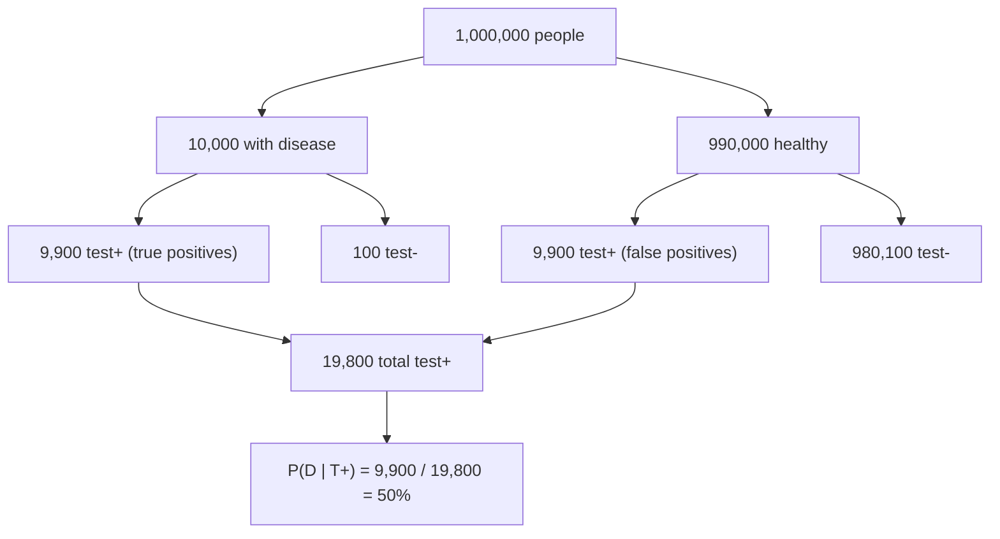

---
tags:
  - simc
---

# Bayes' Theorem

> [!abstract] Prerequisites
> [[conditional-probability]] — Bayes' theorem is derived directly from the conditional probability formula; the whole proof is one line of algebra once that's in your bones.
> [[sample-spaces-events-axioms]] — events and the probability function are the underlying machinery.

## What it is

Bayes' theorem is the math of ==updating your beliefs when you see new evidence==. It's how a rational agent should change their mind in the face of data.

Picture a doctor diagnosing a patient. Before any tests, she has a hunch about how likely the disease is — maybe based on the patient's age, symptoms, and how common the disease is in the population. That's her ==prior== belief. Then a test comes back positive. The test isn't perfect — it has some false-positive rate and some false-negative rate. The question is: given this positive result, what should the doctor now believe?

Bayes' theorem answers that. It takes the prior belief, weights it by how well the evidence agrees with each hypothesis (the ==likelihood==), normalizes the result, and produces an updated belief — the ==posterior==. That's the whole story:

> prior + likelihood + new evidence $\longrightarrow$ posterior

Every "this data updates my model" calculation in statistics, machine learning, and scientific inference is — at heart — Bayes.

## The formula

$$P(A \mid B) = \frac{P(B \mid A) \cdot P(A)}{P(B)}$$

This drops out of conditional probability almost for free. From the definition of conditional probability:

$$P(A \cap B) = P(A \mid B) \cdot P(B)$$

But the same joint event can be written the other way around:

$$P(A \cap B) = P(B \mid A) \cdot P(A)$$

These two expressions describe the same thing, so equate them:

$$P(A \mid B) \cdot P(B) = P(B \mid A) \cdot P(A)$$

Divide both sides by $P(B)$ and you have Bayes' theorem. ==The whole theorem is just the symmetry of joint probability solved for $P(A \mid B)$.== That's it. No deep magic — just bookkeeping.

## The prior / likelihood / posterior decomposition

The four pieces of Bayes' theorem each have a name and a role:

| Term       | Notation      | What it means                                                    |
| ---------- | ------------- | ---------------------------------------------------------------- |
| Prior      | $P(A)$        | What you believed about $A$ **before** seeing evidence           |
| Likelihood | $P(B \mid A)$ | How likely the evidence $B$ would be **if** $A$ were true        |
| Evidence   | $P(B)$        | Total probability of observing $B$ at all (normalizing constant) |
| Posterior  | $P(A \mid B)$ | What you should believe about $A$ **after** seeing $B$           |

The evidence term $P(B)$ is usually computed using the ==law of total probability==, expanding over all hypotheses:

$$P(B) = P(B \mid A) \cdot P(A) + P(B \mid \neg A) \cdot P(\neg A)$$

> [!info] Why "normalizing constant"
> $P(B)$ doesn't depend on which hypothesis you're testing — it's the same denominator whether you're computing $P(A \mid B)$ or $P(\neg A \mid B)$. Its job is to make the posteriors over all hypotheses sum to 1. If you ever just want to compare two hypotheses, you can ignore $P(B)$ entirely and work with ratios — that's the "odds form" of Bayes.

## The full working form

Plugging the total-probability expansion into Bayes:

$$P(A \mid B) = \frac{P(B \mid A) \cdot P(A)}{P(B \mid A) \cdot P(A) + P(B \mid \neg A) \cdot P(\neg A)}$$

This is the form you'll actually compute with. Everything on the right-hand side is something you can know directly: the prior, the true-positive rate, the false-positive rate.

> [!example] The disease-test problem (DO THIS BY HAND)
>
> **Setup:**
> - Base rate: 1% of the population has the disease. $P(D) = 0.01$, so $P(\neg D) = 0.99$
> - Test sensitivity (true positive rate): $P(T^+ \mid D) = 0.99$
> - Test specificity (true negative rate): $P(T^- \mid \neg D) = 0.99$, so the false-positive rate is $P(T^+ \mid \neg D) = 0.01$
>
> You test positive. What is $P(D \mid T^+)$?
>
> Most people guess **99%** — "the test is 99% accurate, I tested positive, so I almost certainly have it." Bayes says otherwise:
>
> $$P(D \mid T^+) = \frac{P(T^+ \mid D) \cdot P(D)}{P(T^+ \mid D) \cdot P(D) + P(T^+ \mid \neg D) \cdot P(\neg D)}$$
>
> $$= \frac{0.99 \cdot 0.01}{0.99 \cdot 0.01 + 0.01 \cdot 0.99} = \frac{0.0099}{0.0198} = 0.50$$
>
> ==Only a 50% chance you actually have the disease.== Coin flip. This is the **base-rate fallacy** — and it's the canonical Bayes "gotcha" for a reason.

### Why? The population-tree intuition

The formula is opaque. The population picture is not. Imagine 1,000,000 people:

- 1% have the disease $\to$ **10,000 sick**, **990,000 healthy**
- Of the 10,000 sick: 99% test positive $\to$ **9,900 true positives**
- Of the 990,000 healthy: 1% test positive $\to$ **9,900 false positives**

So among everyone who tests positive ($9{,}900 + 9{,}900 = 19{,}800$ people), exactly half actually have the disease:

$$\frac{9{,}900}{19{,}800} = 0.50$$

The reason the answer is 50% and not 99% is that ==the low prior (1%) and the false-positive rate (1%) happen to cancel out exactly==. The disease is so rare that the small false-positive rate, applied to the huge healthy population, generates just as many positives as the test correctly catching the small sick population.

> [!warning] Common mistakes
> - **Base-rate neglect.** Ignoring the prior $P(A)$ and reasoning only from the test's accuracy. This is the single most common Bayes mistake.
> - **Confusing $P(D \mid T^+)$ with $P(T^+ \mid D)$.** These read the same in English ("the probability of disease and a positive test going together") but mean different things. The first is what you want; the second is what the test manufacturer reports.
> - **Forgetting to normalize.** The posterior must be a real probability — it has to sum to 1 over all hypotheses. Dividing by $P(B)$ is what makes that happen.
> - **Treating Bayes as one-shot.** It's iterative. Today's posterior becomes tomorrow's prior when more evidence arrives. This is how Bayesian inference scales to chains of data.

> [!tip] Mental model
> ==Multiply the prior by the likelihood, then renormalize.== That's the whole algorithm.
>
> Another way to say it: the posterior is **high** when the evidence would have been **unlikely** under the alternative hypothesis. A positive test only swings your belief hard if false positives are rare *relative to* the prior. Rare disease + non-trivial false-positive rate = the test barely helps.

## Why this matters for SIMC

SIMC modeling problems often give you data and ask "what underlying model produced this?" — that's a Bayesian inverse problem. Even when the problem doesn't say "Bayes" anywhere, the prior/likelihood/posterior structure appears in classification (assigning a label to noisy data), parameter estimation (fitting a model to observations), and decision-making under uncertainty (any "should we trust this measurement?" question). If you can spot the inverse-probability pattern — "I have evidence, I want to know the cause" — you're already 80% of the way to the right setup.

## Code exercise

Companion file: `SIMC/CODINGPRAC/03_bayes_theorem.py`

Simulate 1,000,000 people. For each one:
1. Sample their true disease status from a Bernoulli with $p = 0.01$.
2. If they have the disease, sample their test result from a Bernoulli with $p = 0.99$. If they don't, sample from a Bernoulli with $p = 0.01$ (false-positive rate).
3. Filter to just the people who tested positive.
4. Compute the empirical fraction of those who actually have the disease.

You should get $\approx 0.50$, matching the Bayes formula. ==Don't just take the math's word for it — feel it in the data.==

**Stretch 1:** Vary the prior $P(D)$ from 0.001 to 0.5 in 50 steps. For each prior, compute $P(D \mid T^+)$ from the formula and plot it. Where does the curve cross 50%? Where does it cross 90%? At what base rate does a 99/99 test actually become "trustworthy" in the everyday sense?

**Stretch 2:** Fix sensitivity at 0.99 and vary specificity from 0.90 to 0.999 while keeping the 1% base rate. Then do the reverse: fix specificity at 0.99 and vary sensitivity from 0.90 to 0.999. ==Notice how much more sensitive the posterior is to **specificity** than to **sensitivity** when the disease is rare.== This is the deepest Bayes lesson — for rare events, false positives dominate, and the test's ability to correctly *clear* healthy people matters more than its ability to *catch* sick ones.

## Sources

- [Better Explained: An Intuitive (and Short) Explanation of Bayes' Theorem](https://betterexplained.com/articles/an-intuitive-and-short-explanation-of-bayes-theorem/) — the population-tree intuition and the cancer-test variant
- [Wikipedia: Bayes' theorem](https://en.wikipedia.org/wiki/Bayes%27_theorem) — formula, derivation from conditional probability, historical context
- Penn State STAT 414, Lesson 5.5 (Bayes) — referenced but content unavailable at fetch time
