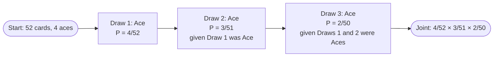

---
tags:
  - simc
---

# Conditional Probability

> [!abstract] Prerequisites
> [[sample-spaces-events-axioms]] — assumes you know what a sample space, event, and probability function are.

## What it is

Conditional probability is the answer to a very specific kind of question:
==given that I already know event $B$ happened, what's the chance event $A$
also happens?== The notation is $P(A \mid B)$, read "the probability of $A$
given $B$." The bar always means "given."

The intuition is simple but it is the whole game: ==when you condition on $B$,
the sample space shrinks to $B$.== You throw away every outcome where $B$
didn't happen, and recompute probabilities inside what's left.

Two quick examples:

- **Weather.** $P(\text{rain tomorrow})$ might be 0.20 on an average day. But
  $P(\text{rain tomorrow} \mid \text{cloudy and humid today})$ might be 0.60.
  The condition changed what you know, so it changed the probability.
- **Cards.** Draw two cards from a 52-card deck without replacement.
  $P(\text{2nd is ace}) = 4/52$ if you know nothing. But
  $P(\text{2nd is ace} \mid \text{1st is ace}) = 3/51$, because once the first
  ace is gone, only 3 aces remain in a 51-card deck. The sample space literally
  shrank from 52 cards to 51, and from 4 aces to 3.

> [!info] The bar reads right-to-left
> $P(A \mid B)$ is "probability of $A$ **given** $B$." What you're solving
> for sits **left** of the bar; what you already know sits **right** of the bar.
> Flipping the sides flips the meaning.

## The formula

$$P(A \mid B) = \frac{P(A \cap B)}{P(B)}, \quad \text{provided } P(B) > 0$$

Why this works: among all the trials where $B$ happened (the denominator),
what fraction *also* had $A$ happen (the numerator)? That ratio IS the
conditional probability. We're rescaling: $P(B)$ used to be some number less
than 1, but conditional on $B$ it becomes 1 (the new whole), so we divide
everything inside the shrunken world by $P(B)$ to renormalize.

Geometrically: picture the sample space as a unit square. $B$ is some region
inside it with area $P(B)$. The overlap $A \cap B$ is a smaller region with
area $P(A \cap B)$. Once you condition on $B$, you zoom in so that $B$ fills
the entire viewport. The fraction of that viewport occupied by $A \cap B$ is
$P(A \cap B) / P(B)$.

> [!warning] The condition $P(B) > 0$ isn't decorative
> You cannot condition on an impossible event. If $P(B) = 0$, the formula
> divides by zero and the question "given $B$ happened" is meaningless
> because $B$ can never happen.

## The multiplication rule

Multiply both sides of the conditional probability formula by $P(B)$ and you
get the **multiplication rule**:

$$P(A \cap B) = P(A \mid B) \cdot P(B) = P(B \mid A) \cdot P(A)$$

It's the same equation, just rearranged. Use whichever form is convenient:

- Use $P(A \mid B) = P(A \cap B) / P(B)$ when you know the joint and the
  marginal and want the conditional.
- Use $P(A \cap B) = P(A \mid B) \cdot P(B)$ when you know the conditional
  and the marginal and want the joint.

Most "sequential events" problems are the second case — you build up the
joint probability of a sequence by multiplying conditionals.

## Sequential events

The multiplication rule generalizes to any number of events. For three:

$$P(A_1 \cap A_2 \cap A_3) = P(A_1) \cdot P(A_2 \mid A_1) \cdot P(A_3 \mid A_1 \cap A_2)$$

In English: the probability that all three happen equals the probability the
first happens, times the probability the second happens given the first
happened, times the probability the third happens given both prior ones
happened. ==Each conditional updates on everything that came before.==

This is exactly the chain you walk through whenever you compute probabilities
for draws-without-replacement, multi-stage experiments, or any process where
later steps depend on earlier outcomes.

> [!example] Worked example: drawing aces without replacement
> What's the probability that the first **two** cards drawn from a standard
> 52-card deck (no replacement) are both aces?
>
> Let $A_1$ = "first card is an ace," $A_2$ = "second card is an ace."
>
> **Step 1.** $P(A_1) = 4/52$. There are 4 aces in 52 cards.
>
> **Step 2.** $P(A_2 \mid A_1) = 3/51$. Given that the first card was an ace,
> the deck now has 51 cards left and only 3 aces remain. The sample space
> shrank from 52 to 51; the favorable outcomes shrank from 4 to 3.
>
> **Step 3.** Multiplication rule:
> $$P(A_1 \cap A_2) = P(A_1) \cdot P(A_2 \mid A_1) = \frac{4}{52} \cdot \frac{3}{51} = \frac{12}{2652} = \frac{1}{221}$$
>
> So roughly a 0.45% chance. The conditional $P(A_2 \mid A_1) = 3/51 \approx
> 0.0588$ is the number we'll verify by simulation in the code exercise.

> [!warning] Common mistakes
> - **Confusing $P(A \mid B)$ with $P(B \mid A)$.** They are NOT the same in
>   general. $P(\text{positive test} \mid \text{has disease})$ (test
>   sensitivity) is very different from $P(\text{has disease} \mid \text{positive test})$
>   (positive predictive value). Mixing them up is called the **prosecutor's
>   fallacy** and has put innocent people in prison.
> - **Conditioning on a zero-probability event.** Formula breaks; the
>   question is meaningless.
> - **Forgetting that conditioning changes the sample space.** Old
>   unconditional probabilities no longer apply once you've conditioned.
>   $P(A) = 0.3$ and $P(A \mid B) = 0.3$ are two separate claims; one does
>   not imply the other (unless $A$ and $B$ are independent, which is a
>   special case for a separate note).
> - **Treating "AND" as multiplication automatically.** $P(A \cap B) =
>   P(A) \cdot P(B)$ ONLY if $A$ and $B$ are independent. In general it's
>   $P(A) \cdot P(B \mid A)$.

> [!tip] Mental model
> **"Conditioning shrinks the world."** When you condition on $B$, mentally
> erase every outcome where $B$ didn't happen, then recompute everything
> inside the smaller world. The denominator of every probability is now
> $P(B)$, not 1. That single move — restricting the sample space — is what
> conditional probability *is*.

## Why this matters for SIMC

Almost every nontrivial probability problem in a competition setting involves
either (a) sequential dependencies (draws without replacement, multi-stage
processes, tree diagrams) or (b) partial information ("given that at least
one of them is..."). Conditional probability is the language for both.
It's also the foundation for Bayes' theorem, independence, and conditional
expectation — none of which make sense until conditioning itself clicks.

## Code exercise

Companion file: `SIMC/CODINGPRAC/02_conditional_probability.py`

Simulate drawing 2 cards (no replacement) from a 52-card deck 100,000 times.
Empirically verify $P(\text{2nd is ace} \mid \text{1st is ace}) = 3/51 \approx 0.0588$.

**Strategy:** simulate all 100,000 trials, then ==filter to just the trials
where the 1st card was an ace==, then compute the fraction within that
filtered set where the 2nd card was also an ace. This is conditioning by
restriction — exactly the "shrink the sample space" move, but done
empirically instead of analytically.

**Stretch goal:** also compute the *unconditional* $P(\text{2nd is ace})$
across all 100,000 trials. Compare it to the conditional. Are they the same?
Different? Why? (Hint: think about what the unconditional probability has to
average over.) This is a sneak preview of why independence is a special,
restrictive condition — not the default.

## Sources

- [Penn State STAT 414, Lesson 4 (Conditional Probability)](https://online.stat.psu.edu/stat414/Lesson04.html) — formula, multiplication rule, extended multiplication rule, renal disease diagnostic example
