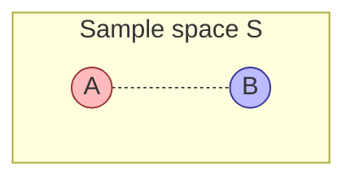

---
tags:
  - simc
---

# Sample Spaces, Events, and Axioms

## What it is

Probability starts with a single, deceptively simple question: ==what could happen?== Before you compute anything, you must enumerate the possibilities. A **sample space** is just that — the set of every possible outcome of a random experiment, written down.

Roll a fair six-sided die. The sample space is $\{1, 2, 3, 4, 5, 6\}$ — six things, one of which definitely happens. Flip a coin: $\{H, T\}$. Flip two coins: $\{HH, HT, TH, TT\}$. That's it. No math yet, just bookkeeping.

An **event** is then a *question you can ask* about the outcome — "did the die show an even number?" — formalised as the subset of the sample space that answers "yes": $\{2, 4, 6\}$. Probability, finally, is a rule for assigning a number between 0 and 1 to each event, telling you how strongly to believe it will happen.

The three together — sample space, events, probability function — are the foundation everything else in this course is built on. Get them wrong and every downstream calculation is silently wrong too.

## Formal definitions

### Sample space

> [!info] Sample space
> The **sample space** $S$ (sometimes $\Omega$) of a random experiment is the set of all possible outcomes. Each outcome is a single element of $S$; exactly one outcome occurs per trial.

Examples:

- One die roll: $S = \{1, 2, 3, 4, 5, 6\}$. Finite, 6 elements.
- One coin flip: $S = \{H, T\}$.
- Two dice (ordered): $S = \{(i, j) : i, j \in \{1, \ldots, 6\}\}$, so $|S| = 36$.
- Number of jeans a random student owns: $S = \{0, 1, 2, 3, \ldots\}$. Countably infinite.
- Time until a radioactive atom decays: $S = [0, \infty)$. Uncountably infinite (continuous).

> [!tip] Choose $S$ to match the question
> The same physical experiment can have different sample spaces depending on what you care about. Two dice could be $S = \{(i,j)\}$ (36 outcomes) or $S = \{2, 3, \ldots, 12\}$ (11 sums) — but those 11 sums are ==not equally likely==. Picking the wrong granularity is the #1 source of "I got the answer wrong and don't know why" in early probability.

### Event

> [!info] Event
> An **event** $E$ is any subset of the sample space: $E \subseteq S$. Events are usually written with capital letters $A, B, C, \ldots$.

A single outcome (e.g. rolling a 3) is a one-element event $\{3\}$. A "compound" event groups several outcomes (e.g. "rolling even") $= \{2, 4, 6\}$.

Because events are sets, all the set algebra works:

| Operation | Notation | Meaning |
|-----------|----------|---------|
| Union | $A \cup B$ | $A$ **or** $B$ (or both) |
| Intersection | $A \cap B$ | $A$ **and** $B$ |
| Complement | $A^c$ (also $A'$, $\bar{A}$) | **not** $A$ |
| Empty event | $\emptyset$ | impossible — no outcomes |
| Mutually exclusive | $A \cap B = \emptyset$ | $A$ and $B$ cannot both happen |
| Exhaustive | $A_1 \cup A_2 \cup \cdots = S$ | at least one of them must happen |

The overlap is $A \cap B$; everything inside either circle is $A \cup B$; everything in $S$ outside the circles is $(A \cup B)^c$.

### Probability function

> [!info] Probability function
> A **probability function** $P$ is a rule that takes an event and returns a real number in $[0, 1]$, written $P(E)$, satisfying the three axioms below. ==$P$ is a function on subsets of $S$, not on outcomes alone.==

Three practical ways to *assign* a $P$:

1. **Classical** — when outcomes are equally likely: $P(E) = \dfrac{|E|}{|S|}$. (Fair dice, fair coins, well-shuffled decks.)
2. **Relative frequency** — repeat the experiment $n$ times, count how often $E$ occurs ($N(E)$ times): $P(E) \approx \dfrac{N(E)}{n}$. Converges as $n \to \infty$ (law of large numbers).
3. **Subjective** — a calibrated belief ("70% chance of rain"). Useful when the experiment can't be repeated.

All three must satisfy the same axioms below to count as probabilities.

## Kolmogorov's axioms

In 1933 Kolmogorov boiled probability down to three rules. Every probability theorem you'll ever prove is a consequence of these.

**Axiom 1 — Non-negativity.** For every event $E \subseteq S$:
$$P(E) \geq 0.$$

*Intuition:* probabilities can't be negative. They measure "how much" of $S$ an event takes up.

**Axiom 2 — Normalization.** The whole sample space has probability 1:
$$P(S) = 1.$$

*Intuition:* *something* in $S$ definitely happens. If you wrote down $S$ correctly, you've covered every possibility, so the total "mass" is 1.

**Axiom 3 — Countable additivity.** For any sequence of pairwise mutually exclusive events $E_1, E_2, E_3, \ldots$ (i.e. $E_i \cap E_j = \emptyset$ for $i \neq j$):
$$P\!\left(\bigcup_{i=1}^{\infty} E_i\right) = \sum_{i=1}^{\infty} P(E_i).$$

The finite case follows: $P(E_1 \cup \cdots \cup E_k) = P(E_1) + \cdots + P(E_k)$ when the $E_i$ are pairwise disjoint.

*Intuition:* if events can't overlap, the chance that one of them happens is the sum of their individual chances. Probability behaves like a measure of "size" — disjoint pieces add up.

> [!warning] Additivity REQUIRES mutual exclusivity
> $P(A \cup B) = P(A) + P(B)$ ==only when $A \cap B = \emptyset$.== If they can both happen, you've double-counted the overlap. Use inclusion-exclusion (below).

## Consequences (theorems that fall out for free)

From the three axioms alone, you can prove all of these:

- **Empty event:** $P(\emptyset) = 0$.
- **Complement:** $P(A^c) = 1 - P(A)$. Often the fast way to compute "at least one" problems.
- **Monotonicity:** if $A \subseteq B$, then $P(A) \leq P(B)$.
- **Upper bound:** $P(A) \leq 1$ for every event.
- **Inclusion–exclusion (two sets):**
  $$P(A \cup B) = P(A) + P(B) - P(A \cap B).$$
- **Inclusion–exclusion (three sets):**
  $$P(A \cup B \cup C) = P(A) + P(B) + P(C) - P(A \cap B) - P(A \cap C) - P(B \cap C) + P(A \cap B \cap C).$$

> [!example] Worked example — sum of two dice
> Roll two fair six-sided dice. What is $P(\text{sum} = 7)$?
>
> **Sample space.** Treat the dice as distinguishable (die 1, die 2):
> $$S = \{(i, j) : i, j \in \{1, \ldots, 6\}\}, \qquad |S| = 36.$$
> Each ordered pair is equally likely with probability $\tfrac{1}{36}$.
>
> **Event.** Let $E = \{(i,j) : i + j = 7\}$. Enumerate:
> $$E = \{(1,6), (2,5), (3,4), (4,3), (5,2), (6,1)\}, \qquad |E| = 6.$$
>
> **Probability.** Classical assignment:
> $$P(E) = \frac{|E|}{|S|} = \frac{6}{36} = \frac{1}{6}.$$
>
> **Sanity check via complement.** $P(\text{sum} \neq 7) = 1 - \tfrac{1}{6} = \tfrac{5}{6}$. Consistent.
>
> **Why distinguishable dice?** If you used $S = \{2, 3, \ldots, 12\}$ (11 sums) and assumed each equally likely, you'd get $P(\text{sum} = 7) = \tfrac{1}{11}$ — ==wrong==. The sums are not equiprobable; 7 has six ways to occur, 2 has only one ($(1,1)$).

> [!warning] Common mistakes
> - **Confusing outcomes with events.** An outcome is a single element of $S$; an event is a *subset* (possibly with many outcomes). "Roll a 4" is an outcome AND a one-element event $\{4\}$; "roll an even number" is a three-element event $\{2,4,6\}$.
> - **Adding probabilities of overlapping events.** $P(A \cup B) \neq P(A) + P(B)$ in general. Always check $A \cap B = \emptyset$ first.
> - **Assuming equiprobability where there is none.** Loaded dice, weighted coins, sums of dice, products of cards — all violate it. Only invoke $P(E) = |E|/|S|$ after you have *justified* equal likelihood.
> - **Picking $S$ at the wrong level of detail.** If outcomes aren't equally likely, the classical formula breaks. Drop down to the finer-grained $S$ where they are.
> - **Forgetting $P(S) = 1$.** When you build a $P$ from scratch, verify all the masses sum to 1. If they don't, you don't have a valid probability function.

## Why this matters for SIMC

SIMC modelling problems almost always start with: "Define a random experiment that captures the situation, identify the sample space, and identify the event of interest." If your $S$ is wrong, every conditional probability, expectation, and distribution you compute downstream is built on sand. Spend the first five minutes of any probability problem just writing $S$ and $E$ explicitly — it forces clarity and catches modelling errors before they propagate.

## Code exercise

Companion file: `SIMC/CODINGPRAC/01_sample_spaces.py`

Simulate 10,000 rolls of a fair six-sided die and empirically verify that $P(\text{even}) = 0.5$. Write the code yourself — no AI. The point is to feel the law of large numbers by watching the empirical estimate converge.

**What to verify:**

- $\hat{P}(\text{even}) \to 0.5$ as $N$ grows.
- $\hat{P}(\text{roll} = k) \to \tfrac{1}{6}$ for each $k \in \{1,\ldots,6\}$.
- $\hat{P}(\text{roll} \geq 5) \to \tfrac{1}{3}$.

**Stretch:** vary $N$ from $10$ to $100{,}000$ (log-spaced) and plot $|\hat{P}(\text{even}) - 0.5|$ vs $N$ on log–log axes. The error should decay roughly like $1/\sqrt{N}$ — this is the central limit theorem peeking out.

## Next

> [!tip] Where this leads
> Once the sample-space / event / axiom triad clicks, build on it:
> - [[conditional-probability]] — what happens when you learn that some event already occurred.
> - [[bayes-theorem]] — the math of updating beliefs from evidence (derived from conditional probability).

## Sources

- [Penn State STAT 414, Lesson 1 — Probability Theory Overview](https://online.stat.psu.edu/stat414/Lesson01.html)
- [Penn State STAT 414, Lesson 2 — Events, Axioms, Theorems](https://online.stat.psu.edu/stat414/Lesson02.html)
- Kolmogorov, A. N. *Grundbegriffe der Wahrscheinlichkeitsrechnung* (1933) — original axiomatic formulation.
