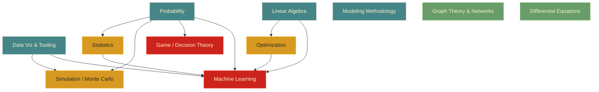

---
tags:
  - simc
---

 
Singapore International Math Challenge. **Team modeling competition.** Singapore, May 24–29, 2026.

> [!info] Tracking
> Scope and progress: `Workflow/progress-SIMC.md`
> Doubts: `Workflow/doubts-SIMC.md`

## ⭐ PCA on IR spectra — crash reading path

> [!tip] The teachers hinted the comp centers on **PCA applied to IR spectroscopy data**. These 28 notes build that idea from zero linear-algebra knowledge. **Read top to bottom** — each one only assumes the ones above it. (Built 2026-05-25.)

**Phase 1 — Vectors & matrices (the alphabet)**
1. [[vector]]
2. [[what-is-a-dimension]]
3. [[matrix]]
4. [[design-matrix]]

**Phase 2 — Operations on vectors**
5. [[dot-product]]
6. [[vector-norm-and-distance]]
7. [[matrix-vector-multiplication]]
8. [[vector-projection]]

**Phase 3 — Statistics (bridges off your probability)**
9. [[mean-and-centering]]
10. [[variance]]
11. [[covariance]]
12. [[covariance-matrix]]
13. [[diagonal-covariance-matrix]]

**Phase 4 — Eigenvalues/eigenvectors (the engine)**
14. [[eigenvectors-and-eigenvalues]]
15. [[power-method]]
16. [[rayleigh-quotient]]
17. [[eigenvectors-of-the-covariance-matrix]] ← keystone

**Phase 5 — Why high dimensions are weird**
18. [[curse-of-dimensionality]]
19. [[surface-to-volume-ratio-high-dimensions]]
20. [[distance-concentration-high-dimensions]]
21. [[curse-of-sampling]]
22. [[manifold-hypothesis]]

**Phase 6 — PCA itself**
23. [[principal-component-analysis]]
24. [[eigenspectrum]]
25. [[dimensionality-reduction]]

**Phase 7 — The chemistry payoff**
26. [[ir-spectroscopy]]
27. [[beer-lambert-law]]
28. [[pca-on-ir-spectra]] ← the summit

## Topic index

Notes get added as wikilinks once each concept file is created.

### Probability
Sample spaces, conditional / Bayes, distributions (discrete + continuous), expectation, variance, CLT, linearity of expectation.

Notes:
- [[sample-spaces-events-axioms]]
- [[conditional-probability]]
- [[bayes-theorem]]

### Statistics
Descriptive stats, sampling distributions, confidence intervals, hypothesis testing (z/t/χ²/ANOVA), p-values, linear regression, residual analysis.

Notes:
- [[mean-and-centering]]
- [[variance]]
- [[covariance]]
- [[covariance-matrix]]
- [[diagonal-covariance-matrix]]

### Linear Algebra
Vectors, dot product, norms, matrix ops, linear systems, eigenvalues, SVD, projections, Gram matrix.

Notes:
- [[vector]]
- [[what-is-a-dimension]]
- [[matrix]]
- [[design-matrix]]
- [[matrix-vector-multiplication]]
- [[dot-product]]
- [[vector-norm-and-distance]]
- [[vector-projection]]
- [[eigenvectors-and-eigenvalues]]
- [[power-method]]
- [[rayleigh-quotient]]

### Machine Learning
Supervised vs unsupervised, linear/logistic regression, K-means, PCA, decision trees, similarity metrics, train/val/test split, overfitting & regularization.

Notes:
- [[eigenvectors-of-the-covariance-matrix]]
- [[curse-of-dimensionality]]
- [[surface-to-volume-ratio-high-dimensions]]
- [[distance-concentration-high-dimensions]]
- [[curse-of-sampling]]
- [[manifold-hypothesis]]
- [[principal-component-analysis]]
- [[eigenspectrum]]
- [[dimensionality-reduction]]

### Spectroscopy (application domain)
How IR spectra become high-dimensional data, why Beer–Lambert linearity makes PCA exact, and the full PCA-on-spectra pipeline.

Notes:
- [[ir-spectroscopy]]
- [[beer-lambert-law]]
- [[pca-on-ir-spectra]]

### Optimization
Convex vs non-convex, gradient descent, Lagrange multipliers, linear programming, integer/combinatorial basics, KKT (awareness).

### Mathematical Modeling Methodology
Problem decomposition, assumption logging, model formulation, validation, sensitivity analysis, limitations, report structure (exec summary → method → results → limitations).

### Simulation / Monte Carlo
RNG & seeding, MC integration, MC verification of analytical results, discrete-event simulation, agent-based modeling, bootstrap resampling.

### Differential Equations
First-order ODEs, second-order linear, systems (SIR, predator-prey), numerical solvers (Euler, RK), equilibria & stability.

### Graph Theory & Networks
Representation (adjacency matrix/list), BFS/DFS, Dijkstra, MST (Kruskal/Prim), network flow, centrality (degree, betweenness, PageRank).

### Game / Decision Theory
Expected utility, decision trees, zero-sum games, minimax, Nash equilibrium (pure & mixed), prisoner's dilemma, voting/social choice.

### Data Viz & Tooling
NumPy, pandas, matplotlib (line/scatter/hist/heatmap/imshow), seaborn, plotly, report-grade formatting.

Notes:
- [[type-hints]]
- [[python-for-java-devs]]
- [[numpy-basics]]
- [[matplotlib-basics]]
- [[histogram-bins]]

## Learning path

### Dependency graph

### Suggested order

> [!tip] Read top to bottom. Tiers can overlap — anything in a higher tier unlocks everything that depends on it.

**Tier 1 — Foundations (no deps, start here):**
1. **Data Viz & Tooling** — NumPy/pandas/matplotlib. You need this to *do* anything; sets the tooling floor for every other topic.
2. **Probability** — gates Statistics, Simulation, ML, Game Theory. Highest-leverage single topic.
3. **Linear Algebra** — gates Optimization and ML. Parallel-able with Probability.
4. **Modeling Methodology** — meta-skill (assumptions, validation, sensitivity, report structure). Learn early so it shapes everything else; this is what SIMC graders actually score.

**Tier 2 — Direct extensions:**

5. **Statistics** — needs Probability.
6. **Optimization** — needs Linear Algebra.
7. **Simulation / Monte Carlo** — needs Probability + Tooling.

**Tier 3 — Composite / applied:**

8. **Machine Learning** — needs Prob + Stats + LA + Optimization + Tooling. Last because it's the integration layer.
9. **Game / Decision Theory** — needs Probability.

**Tier 4 — Independent specialties (slot in anytime):**

10. **Graph Theory & Networks** — combinatorial, no real prereqs from this list.
11. **Differential Equations** — calculus prereq (already covered). Useful if the problem is dynamic/time-evolving.

### Critical path

Shortest route to being SIMC-functional, ignoring breadth:

**Tooling → Probability → Modeling Methodology → Statistics → Simulation**

These five let you attack a huge fraction of past SIMC problems (data → model → simulate → report). Everything else is a multiplier on top.

## Team

Adithya Kesan Jayakanth (AKJ , me) , K Vishnu Kumar , Adithya Anand (Different adithya from me)

## Sources

*Add textbooks, past problems, and reference PDFs to `SOURCES/SIMC/` as they're gathered.*
